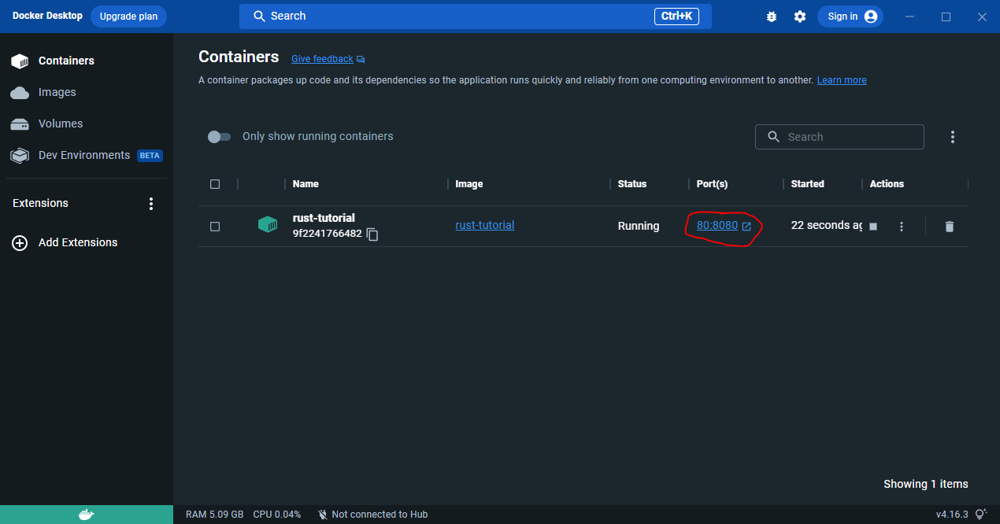
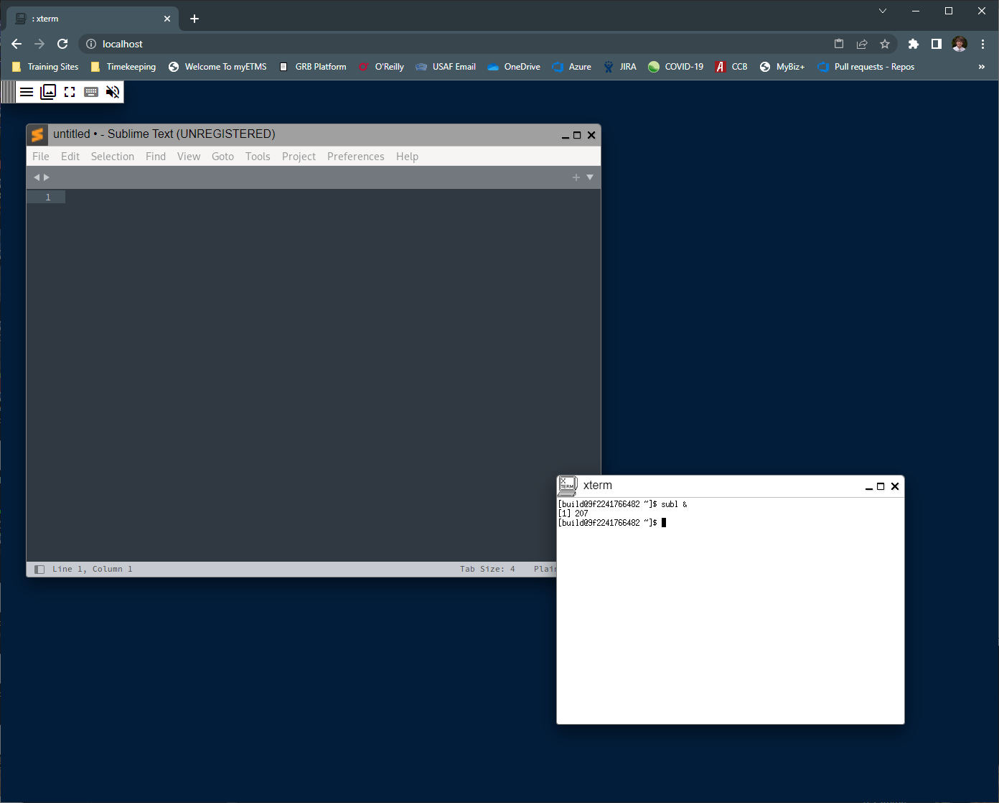
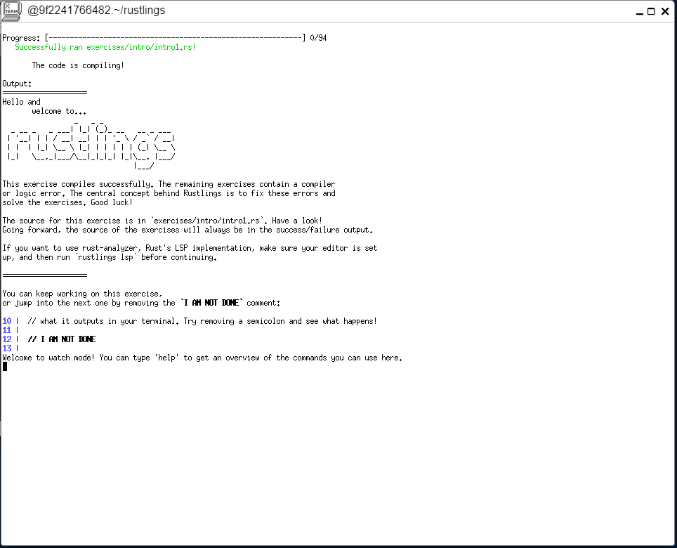

# Arch-Xpra-Docker
Dockerfile using Arch as base distribution with OpenGL support for use with Xpra

The make build command turns the Dockerfile into a dockerimage titled "xpra-html5" The make run command launches a detached Docker container with port 10000 exposed to port 80 locally. This allows for connection to the Xpra Webclient with the address using localhost.

# Running the Rust tutorial
1. Launch the Docker Desktop program
2. Using Powershell, build the docker image using the command: `docker build -t="rust-tutorial" .`
3. Run the docker image using the command: `docker run -d -p 80:8080 --name rust-tutorial rust-tutorial`
4. Select the link to the exposed port from the Docker Desktop program.

5. Launch the sublime text editor using the command `subl &` inside  the xterm window located in your browser
   * **NOTE: Do not close the xterm window. It can not be reopened**

6. Navigate to the `rustlings` folder in the xterm window and launch `rustinglings watch` command to open the tutorial

7. Open the folder `home/rustlings/exercises` inside the sublime text editor
8. Complete the Rustlings tutorial starting with the exercise `intro1.rs`